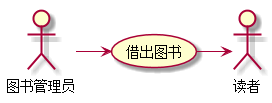
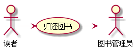
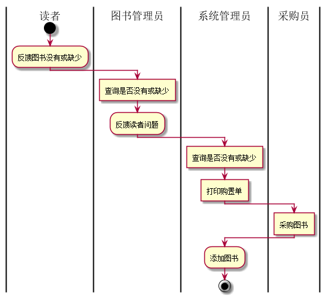
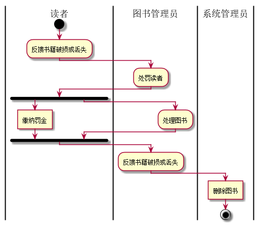

# 实验二：图书管理系统用例建模

| 学号 | 班级 | 姓名 | 照片|
|:----:|:-----:|:----:|:----:|
| 201510414323 | 软件（本）15-3 | 杨双友 |  |

## 1.图书管理系统的用例关系图
### 1.1用例图PlantUML源码如下：
    @startuml
    学生图书管理员 -left-> (借出图书)
    学生图书管理员 -left-> (归还图书)
    学生图书管理员 --> (查询图书)
    教师图书管理员 --> (维护书目)
    教师图书管理员 -->(借出图书)
    教师图书管理员 --->(归还图书)
    教师图书管理员 -->(查询图书)
    系统管理员 -up->(增加图书)
    系统管理员 -up->(删除图书)
    系统管理员 -up->(修改图书)
    系统管理员 -up->(查询图书)
    系统管理员 -up->(日志查看)
    系统管理员 -up->(用户修改)
    系统管理员 -up->(系统维护)
    学生 -down->(查询图书)
    学生 -right->(预定图书)
    学生 -right->(取消预定)
    学生 -right->(查询自己借阅情况)
    学生 -right->(查询欠费情况)
    教师 -down->(查询图书)
    教师 -->(预定图书)
    教师 -->(取消预定)
    教师 -->(查询自己借阅情况)
    教师 -->(查询欠费情况)
    教师 -->(查询自己学生借阅情况)
    @enduml
### 1.2. 用例图如下：

## 2. 参与者说明：
### 2.1学生图书管理员
主要职责是：负责帮助教师管理员给来图书馆借还图书的读者进行处理
### 2.2教师图书管理员
主要职责是：负责给读者借还图书进行处理，还要处理图书书目的问题
### 2.3系统管理员
主要职责是：负责图书馆的图书的增删改查，读者用户的增删改查，管理员的增删改查，系统的维护，日志的查看
### 2.4学生
主要职责是：能对图书进行查询，查询自己在图书馆的借书情况，查询欠费书籍的情况，预定和取消预定
### 2.5教师
主要职责是：能对图书进行查询，查询自己在图书馆的借书情况，查询欠费书籍的情况，预定和取消预定，并能查询自己的学生在图书馆的借书情况
## 3.用例规约表
### 3.1“借出图书”用例

| 用例名称 | 借出图书 |
|:----:|:-----:|
| 参与者 | 学生图书管理员（主要参与者），教师图书管理员（主要参与者），学生（次要参与者），教师（次要参与者） |
| 前置条件 | 图书管理员已被识别和授权，该图书未借出 |
| 后置条件 | 存储借书记录，更新库存数量，所借图书状态为借出 |
| 主事件流 | 1. 图书管理员将读者借书卡提供给系统；2. 系统验证读者身份和借书条件；3. 图书管理员将读者所借图书输入系统；4. 系统记录借书信息，并且修改图书的状态和此书的可借数量；5. 系统累加读者的借书数量；6. 重复3~5，直到图书管理员确认全部图书登记完毕；7. 系统打印借书清单，交易成功完成 |
| 备注 | 图书馆开架借阅，读者找到书后办理借书手续，因此结束不需要验证库存，而且每本书都可识别 |

### 3.2“归还图书”用例

| 用例名称 | 归还图书 |
|:----:|:-----:|
| 参与者 | 学生图书管理员（主要参与者），教师图书管理员（主要参与者），学生（次要参与者），教师（次要参与者） |
| 前置条件 | 图书管理员已被识别和授权，该图书已借出 |
| 后置条件 | 存储借书记录，更新库存数量，所借图书状态为未借出 |
| 主事件流 | 1. 图书管理员将读者借书卡提供给系统；2. 系统验证读者身份和还书条件；3. 图书管理员将读者所还图书输入系统；4. 系统记录还书信息，并且修改图书的状态和此书的可借数量；5. 系统累加读者的还书数量；6. 重复3~5，直到图书管理员确认全部图书登记完毕；7. 系统打印还书清单，交易成功完成 |
| 备注 | 无 |

### 3.3“添加图书”用例
#### 用例图如下

#### 代码如下
    @startuml
    |读者|
    start
    :反馈图书没有或缺少;
    |图书管理员|
    :查询是否没有或缺少]
    :反馈读者问题;
    |系统管理员|
    :查询是否没有或缺少]
    :打印购置单]
    |采购员|
    :采购图书]
    |系统管理员|
    :添加图书;
    stop
    @enduml
### 3.4“删除图书”用例

#### 用例图如下

#### 代码如下
    @startuml
    |读者|
    start
    :反馈书籍破损或丢失;
    |图书管理员|
    :处罚读者;
    fork
    |读者|
    :缴纳罚金]
    fork again
    |图书管理员|
    :处理图书;
    fork end
    |图书管理员|
    :反馈书籍破损或丢失;
    |系统管理员|
    :删除图书]
    stop
    @enduml 