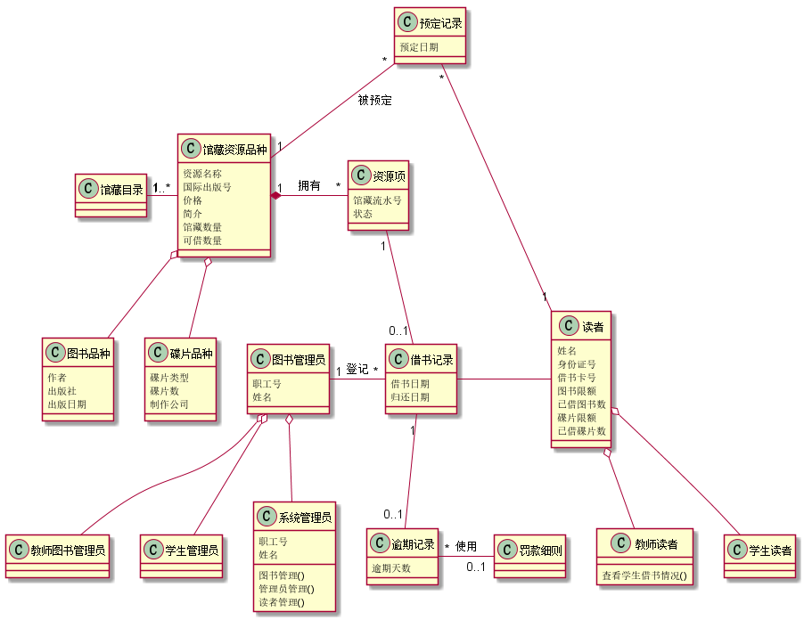
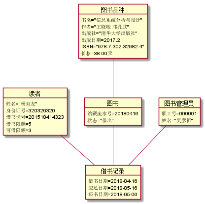
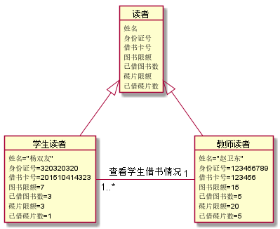
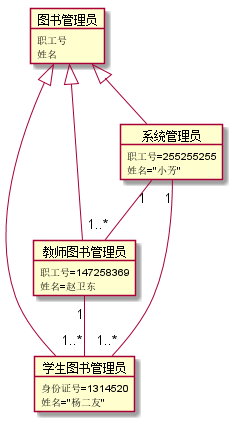

# 实验3：图书管理系统领域对象建模

| 学号 | 班级 | 姓名 | 照片|
|:----:|:-----:|:----:|:----:|
| 201510414323 | 软件（本）15-3 | 杨双友|  |

## 1. 图书管理系统的类图

### 1.1 类图PlantUML源码如下：
     @startuml
     class 馆藏目录{
 
     }
     class 馆藏资源品种{
         资源名称
         国际出版号
         价格
         简介
         馆藏数量
         可借数量
     }
     class 碟片品种{
         碟片类型
         碟片数
         制作公司
     }
     class 图书品种{
         作者
         出版社
         出版日期
     }
     class 预定记录{
         预定日期
     }
     class 资源项{
         馆藏流水号
         状态
     }
     class 借书记录{
         借书日期
         归还日期
     }
     class 读者{
         姓名
         身份证号
         借书卡号
         图书限额
         已借图书数
         碟片限额
         已借碟片数
     }
     class 教师读者{
         查看学生借书情况()
     }
     class 学生读者{
     }
     class 图书管理员{
         职工号
         姓名
     }
     class 教师图书管理员{
 
     }
     class 学生管理员{
     }
     class 逾期记录{
         逾期天数
     }
     class 罚款细则{
     }
     class 系统管理员{
         职工号
         姓名
         图书管理()
         管理员管理()
         读者管理()
     }
     馆藏目录 "1" --right"1..*" 馆藏资源品种
     馆藏资源品种 "1" --up "*" 预定记录:被预定
     预定记录 "*" --down "1" 读者
     馆藏资源品种 "1"*--right "*"资源项:拥有
     馆藏资源品种 o--down 碟片品种
     馆藏资源品种 o--down 图书品种
     资源项 "1"--down "0..1"借书记录
     读者 --left 借书记录
     图书管理员 "1"--right"*" 借书记录:登记
     借书记录 "1"--down "0..1" 逾期记录
     逾期记录 "*"--right"0..1" 罚款细则:使用
     读者 o-- 学生读者
     读者 o-- 教师读者
     图书管理员 o-- 教师图书管理员
     图书管理员 o-- 学生管理员
     图书管理员 o-- 系统管理员
     @enduml
### 1.2. 类图如下：

### 1.3. 类图说明：
该系统为图书馆管理系统的类图，包含的对象为图书，碟片，学生读者，教师读者，系统管理员，教师图书管理员，学生图书管理员，学生读者和教师读者继承于读者类，系统管理员，学生管理员，教师图书管理员继承于图书管理员。该系统主要的功能为读者提供借还书的服务，该系统还为读者提供了预定图书的功能。
## 2. 图书管理系统的对象图
### 2.1 类读者借书还书的对象图
#### PlantUML源码如下：
    @startuml
    object 读者 {
        姓名="杨双友"
        身份证号=320320320
        借书卡号=201510414323
        借书限额=5
        可借限额=3
    }
    object 借书记录{
        借书日期=2018-04-16
        应还日期=2018-05-16
        还书日期=2018-05-06
    }
    object 图书{
        馆藏流水号=20180416
        状态="借出"
    }
    object 图书品种{
        书名="信息系统分析与设计"
        作者="王晓敏 邝孔武"
        出版社="清华大学出版社"
        出版日期=1998-06
        国际出版号="978-7-302-32982-4"
        价格=45
    }
    object 图书管理员{
        职工号=000001
        姓名="吴彦祖"
    }
    读者 -- 借书记录
    图书品种 -- 图书
    图书 -- 借书记录
    图书管理员 -- 借书记录
    @enduml
#### 对象图如下：

### 2.2读者关系对象图
#### 源码如下：
    @startuml
    object 读者{
        姓名
        身份证号
        借书卡号
        图书限额
        已借图书数
        碟片限额
        已借碟片数
    }
    object 学生读者{
        姓名="杨双友"
        身份证号=320320320
        借书卡号=201510414323
        图书限额=7
        已借图书数=3
        碟片限额=3
        已借碟片数=1
    }
    object 教师读者{
        姓名="赵卫东"
        身份证号=123456789
        借书卡号=123456
        图书限额=15
        已借图书数=5
        碟片限额=20
        已借碟片数=5
    }
    读者 <|-- 学生读者
    读者 <|-- 教师读者
    教师读者 "1"--left"1..*" 学生读者:查看学生借书情况
    @enduml
#### 对象图如下：

### 2.3图书管理员关系对象图如下
#### 源码如下：
    @startuml
    object 图书管理员{
        职工号
        姓名
    }
    object 学生图书管理员{
        身份证号=1314520
        姓名="杨二友"
    }
    object 教师图书管理员{
        职工号=147258369
        姓名=赵卫东
    }
    object 系统管理员{
        职工号=255255255
        姓名="小芳"
    }
    图书管理员 <|-- 学生图书管理员
    图书管理员 <|-- 教师图书管理员
    图书管理员 <|-- 系统管理员
    系统管理员 "1"-- "1..*"学生图书管理员
    系统管理员 "1"-- "1..*"教师图书管理员
    教师图书管理员 "1"-- "1..*"学生图书管理员
    @enduml
#### 对象图如下：

