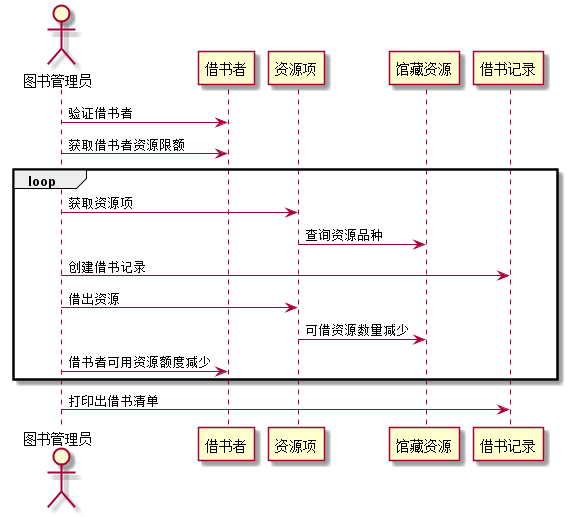

# 实验四：图书管理系统顺序图绘制

| 学号 | 班级 | 姓名 | 照片|
|:----:|:-----:|:----:|:----:|
| 201510414323 | 软件（本）15-3 | 杨双友 | [](./yangshuangyou.png) |


### ***根据用例图和类图，画出部分用例的顺序图包括：借书、还书、添加图书、删除图书等。***
### 1.借书顺序图
#### 1.1代码如下：
```
@startuml
actor 图书管理员
图书管理员->借书者:验证借书者
图书管理员->借书者:获取借书者资源限额
loop
图书管理员->资源项:获取资源项
资源项->馆藏资源:查询资源品种
图书管理员->借书记录:创建借书记录
图书管理员->资源项:借出资源
资源项->馆藏资源:可借资源数量减少
图书管理员->借书者:借书者可用资源额度减少
end
图书管理员->借书记录:打印出借书清单
@enduml
```
#### 1.2顺序图如下：

* **说明:借书者借书首先要验证借书者信息和可用额度，然后再由图书管理员发起借书请求，创建借书记录，并同时根据借出的资源数来减少借书者的可借资源额度，并减少相应数量的图书馆资源数量。**
### 2.还书顺序图
#### 2.1代码如下：
```
@startuml
actor 图书管理员
图书管理员->资源项:读取资源信息
资源项->借书记录:获取借书记录
资源项->馆藏资源:获取资源的种类
图书管理员->借书者:获取借书者信息
图书管理员->资源项:归还资源
资源项->馆藏资源:增加可借资源额度
图书管理员->借书记录:记录还书日期
opt 逾期
图书管理员->逾期记录:记录逾期记录
借书者-->图书管理员:支付逾期罚金
end
@enduml
```
#### 2.2顺序图如下：

* **说明:还书首先要验证借书者信息，然后再由图书管理员发起还书请求，增加借书者资源可借数量和可借额度，同时增加相应的图书馆资源数量，然后登记还书日期，如果用户还书超期，还需进行逾期记录和罚款**
### 3.添加图书顺序图
#### 3.1代码如下：
```
@startuml
actor 系统管理员
actor 图书管理员
actor  采购员
actor 借书者
借书者-->系统管理员:反馈图书缺少
系统管理员->资源项:查询是否缺少资源
图书管理员->资源项:查询是否缺少资源
资源项->馆藏资源:查询资源种类
馆藏资源->图书数量:查询图书数量
图书数量-->图书管理员:返回数量
图书数量-->系统管理员:返回数量
采购员->图书数量:购买图书
系统管理员->馆藏资源:添加图书
@enduml
```
#### 3.2顺序图如下：

* **说明:借书者反馈图书种类或这数量是否缺少或者完全没有，提交反馈到系统管理员和图书管理员，管理员查询馆藏资源中的图书数量或种类是否缺失，让后由采购员购买图书，并由系统管理员添加到馆藏资源中。**
### 4.删除图书顺序图
#### 4.1代码如下：
```
@startuml
actor 图书管理员
actor 借书者
actor 系统管理员
借书者-->图书管理员:反馈图书缺损或丢失
图书管理员->借书者:确认图书损坏
图书管理员->系统管理员:反馈图书缺损或丢失
opt 图书损坏
系统管理员->图书:删除图书
系统管理员->删除记录:创建删除记录
借书者-->图书管理员:缴纳罚款
end
@enduml
```
#### 4.2顺序图如下：

* **说明:借书者还书时向图书管理员反馈所借图书已丢失或损坏，图书管理员确认后向系统管理员反馈并对借书者进行罚款，然后由系统管理员删除图书并登记**

### 5.图书管理系统参考资料
#### 5.1用例图参考如下

#### 5.2类图参考如下


