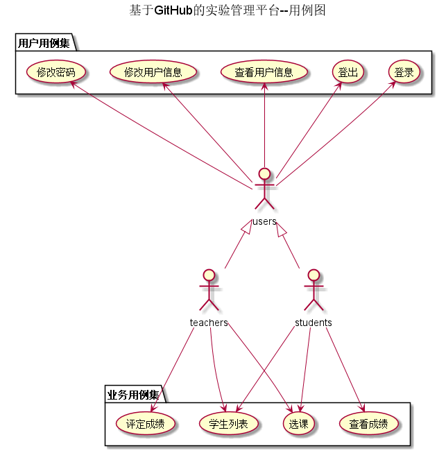

# 基于GitHub的实验管理平台的分析与设计

### 成都大学信息科学与工程学院

|学号|班级|姓名|照片|
|:-------:|:-------------: | :----------:|:---:|
|201510414323|软件(本)15-3|杨双友||

## 1. 概述
- 基于GitHub的实验管理平台的作用是在线管理实验成绩的Web应用系统。学生和老师的实验内容均存放在GitHUB
  页面上。
- 学生的功能主要有：一是设置自己的GitHub用户名，二是查询自己的实验成绩。学生的GitHub用户名是公开的，但成绩不公开。
- 老师的功能主要有：一是批改每个学生的成绩，二是查看每个学生的成绩。
- 老师和学生都能通过本系统的链接方便地跳转到学生的每个GitHUB实验目录，以便批改实验或者查看实验情况。
- 实验成绩按数字分数计算，每项实验的满分为100分，最低为0分。
- 系统自动计算每个学生的所有实验的平均分。
- 该基于Github的实验管理平台的主要作用是方便学生提交和老师批改作业，实现了去中心化。
- 老师可以在该平台查看每一个学生每一学期的每门课程,每一个实验的情况，并根据每一个部分的完成度打分，
- 学生之间也可以互相查看实验，但不能互相看到分数。
- 一个老师可以上多门课，每个老师只能维护老师自己的课程及成绩。
- 一人同学可以上多门课，每个同学只能查询同学自己的课程的实验成绩。
- 老师和同学都可以选多门课程，但必须是老师先选，学生后选。
- 每个实验的实验成绩细分为多个评分项，每个评分项对应各自的评分标准。
## 2. 系统总体结构
 
## 3. 用例图设计 [源码](./Usecase.puml)

## 4. 类图设计 [源码](./class.puml)

## 5. 数据库设计
     
- ### USERS表（用户表）

    |字段|类型|主键，外键|可以为空|默认值|约束|说明|
    |:-------:|:-------------:|:------:|:----:|:---:|:----:|:----------|
    |USER_ID|NUMBER(8,0)|主键|否| | | 用户ID|
    |NAME|VARCHAR2(50 BYTE)| |否| | | 用户真实姓名|
    |GITHUB_USERNAME|VARCHAR2(50 BYTE)| |是|空| | GitHUB用户名|
    |UPDATE_DATE|DATE| |是|空| | GitHUB用户名修改日期|
    |PASSWORD|VARCHAR2(512 BYTE)| |是|空| | 加密存储密码，为空表示密码就是学号|
    |DISABLE|VARCHAR2(20 BYTE)| |否| | |是否禁用,值为是表示禁用,其他表示正常.|

- ### TEACHERS表（老师表）

    |字段|类型|主键，外键|可以为空|默认值|约束|说明|
    |:-------:|:-------------:|:------:|:----:|:---:|:----:|:----------|
    |TEACHER_ID|VARCHAR2(50 BYTE)|主键|否| | | 老师的编号|
    |USER_ID|NUMBER(8,0)|外键|是| | | 老师的用户ID，USERS表的外键|
    |DEPARTMENT|VARCHAR2(400 BYTE)| |否| | | 老师属于的部门|
    |TEACHER_NAME|VARCHAR2(50 BYTE)| |否| | | 老师真实姓名|

- ### STUDENTS表（学生表）

    |字段|类型|主键，外键|可以为空|默认值|约束|说明|
    |:-------:|:-------------:|:------:|:----:|:---:|:----:|:----------|
    |STUDENT_ID|VARCHAR2(50 BYTE)|主键|否| | | 学生的学号|
    |STUDENT_NAME|VARCHAR2(50 BYTE)| |否| | | 学生真实姓名|
    |USER_ID|NUMBER(8,0)|外键|是| |空| 学生的用户ID，USERS表的外键，为空表示还没有建立用户|
    |CLASS|VARCHAR2(20 BYTE)| |否| | | 学生班级|
    |RESULT_SUM|VARCHAR2(400 BYTE)|外键|是|空| | 成绩汇总（来自GRADES表），以逗号分开，第一个成绩是平均成绩,后面是每次实验的成绩，N表示未批改，平均分只计算已批改的。比如：“81.25,70,80,85,90,N”表示一共批改了4次，第5次未批改，4次的成绩分别是81.25,70,80,85,90,N，4次的平均分是81.25|
    |WEB_SUM|VARCHAR2(400 BYTE)| |是|空| | GitHub网址是否正确，用逗号分开，Y代表正确，N代表不正确。第1位代表总的GitHUB地址是否正确，第2位表示第1次实验的地址，第3位表示第2位实验地址，依此类推。比如：“Y,Y,Y,Y,Y,N”表示第5次实验地址不正确，其他地址正确|
 
- ### GRADES表（学生实验成绩表）

    |字段|类型|主键，外键|可以为空|默认值|约束|说明|
    |:-------:|:-------------:|:------:|:----:|:---:|:----:|:----------|
    |STUDENT_ID|VARCHAR2(50 BYTE)|联合主键1，外键|否| | | 学生的学号，STUDENTS表外键|
    |TEST_ID|NUMBER(6,0)|联合主键2，外键|否| | | 实验编号，TESTS表的外键|
    |RESULT|NUMBER|主键|是|空| 取值0-100| 分数，这个值为空表示没有批改|
    |MEMO|VARCHAR2(400 BYTE)| |是|空| | 老师对实验的评语|
    |PART|VARCHAR2(200 BYTE)| |否| | | 实验的评分细则|
    |PART_GRADES|NUMBER| |否| | |每个评分细则的分数|
    |UPDATE_DATE|DATE| |是|空| |老师批改实验的日期，为空表示未批改|

- ### TESTS表（实验项目表）

    |字段|类型|主键，外键|可以为空|默认值|约束|说明|
    |:-------:|:-------------:|:------:|:----:|:---:|:----:|:----------|
    |TESTS_ID|NUMBER(6,0)|主键|否| | | 实验编号|
    |TSETS_NAME|VARCHAR2(100 BYTE)| |否| | | 实验名称|
    
- ### COURSES表（课程表）
    
    |字段|类型|主键，外键|可以为空|默认值|约束|说明|
    |:-------:|:-------------:|:------:|:----:|:---:|:----:|:----------|
    |COURSES_ID|NUMBER(6,0)|主键|否| | | 课程编号|
    |COURSES_NAME|VARCHAR2(100 BYTE)| |否| | | 课程名称|
    |COURSES_TEACH|VARCHAR2(100 BYTE)| |否| | | 开课教师|
    |COURSES_COLL|VARCHAR2(100 BYTE)| |否| | | 开课学院|
- ### SEMESTERS表（学期表）
    
    |字段|类型|主键，外键|可以为空|默认值|约束|说明|
    |:-------:|:-------------:|:------:|:----:|:---:|:----:|:----------|
    |SEMESTERS_ID|NUMBER(6,0)|主键|否| | | 学期编号|
    |SEMESTER_NAME|VARCHAR2(100 BYTE)| |否| | | 学期名称|

## 6. 用例及界面详细设计
  ### [学生列表_用例](./用例_学生列表.md) 
  ### [查看成绩_用例](./用例_查看成绩.md)
  ### [评定成绩_用例](./用例_评定成绩.md)
  ### [登录_用例](./用例_登录.md)
  ### [用户信息管理_用例](./用例_用户信息管理.md)
  ### [选课_用例](https://github.com/yangshuangyou/is_analysis/blob/master/test6/%E7%94%A8%E4%BE%8B_%E9%80%89%E8%AF%BE%20.md)

