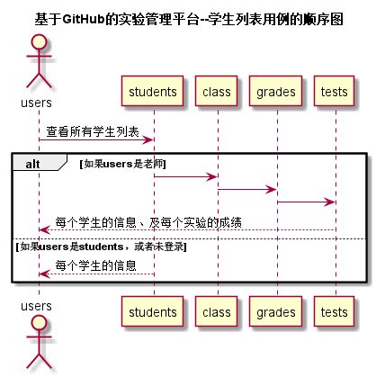
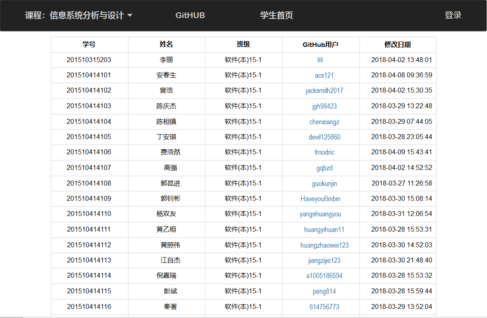

# “学生列表”用例 [返回](./README.md)
## 1. 用例规约

|用例名称|学生列表|
|-------|:-------------|
|功能|以表形式的显示出所有学生的信息|
|参与者|游客，学生，老师|
|前置条件|学生，老师需要先登录|
|后置条件| |
|主流事件| |
|备注| |

## 2. 业务流程（顺序图） [源码](./sequence学生列表.puml)
 

## 3. 界面设计
 

## 4. 算法描述（活动图）

- WEB_SUM解析为列表  
  - WEB_SUM是接口getStudents的返回值中的一部分，形如："WEB_SUM": "Y,Y,Y,Y,Y,N"。需要在前端进行解析。  
  - 作用是判断GitHub网址是否正确，用逗号分开，Y代表正确，N代表不正确。  
  - 第1位代表总的GitHUB地址是否正确，第2位表示第1次实验的地址，第3位表示第2位实验地址，依此类推。
  - 比如：“Y,Y,Y,Y,Y,N”表示第5次实验地址不正确，其他地址正确。  
  - 算法是使用使用字符串分离方法将其分开。

- RESULT_SUM解析为列表
    - RESULT_SUM是接口getStudents的返回值中的一部分，形如："RESULT_SUM": "81.25,70,80,85,90,N"。需要在前端进行解析。
    - 成绩汇总（来自GRADES表），以逗号分开，第一个成绩是平均成绩,后面是每次实验的成绩，N表示未批改，平均分只计算已批改的。    
    - 比如：“81.25,70,80,85,90,N”表示一共批改了4次，第5次未批改，4次的成绩分别是81.25,70,80,85,90,N，4次的平均分是81.25
    - 算法是使用使用字符串分离方法将其分开。
## 5. 参照表

- students
- grades
- tests

## 6. API接口设计

- 接口名称：getStudents
    
- 功能：
    返回所有学生的列表。   
    
    学生登录，或者未登录不能看到RESULT_SUM，WEB_SUM，老师登录可以看到RESULT_SUM，WEB_SUM。
    
    该接口服务于：http://202.115.82.8:1521
    
- API请求地址： 
    http://202.115.82.8:1521/v1/api/getStudents

- 请求方式 ：
    GET  

- 请求参数说明:        
    无
    
- 返回实例：

        {
            "status": true,
            "info": null, 
            "total": 121,         
            "data": [
                {"WEB_SUM": "Y,Y,Y,Y,Y,N", 
                "RESULT_SUM": "83.75,90,80,80,85,N", 
                "GITHUB_USERNAME": "Chinajuedui", 
                "STUDENT_ID": "201510315203", 
                "CLASS": "软件(本)15-1", 
                "NAME": "陈松华", 
                "UPDATE_DATE": "2018-04-02 13:48:01"}, 
                {
                ...其他学生
                }
            ] 
        }
  
- 返回参数说明：    
 
  |参数名称|说明|
  |:---------:|:--------------------------------------------------------|      
  |status|bool类型，true表示正确的返回，false表示有错误|
  |info|返回结果说明信息|
  |total|返回学生人数|
  |data|所有学生的数组|
  |WEB_SUM|网址是否正确的汇总|
  |RESULT_SUM|成绩的汇总|
  |GITHUB_USERNAME|GITHUB 用户名|
  |STUDENT_ID|学号|
  |CLASS|班级|
  |NAME|真实姓名|
  |UPDATE_DATE|GitHUB用户名修改日期|
