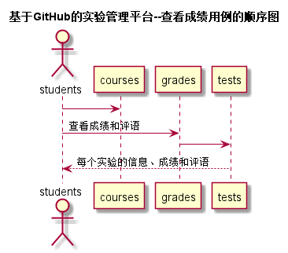
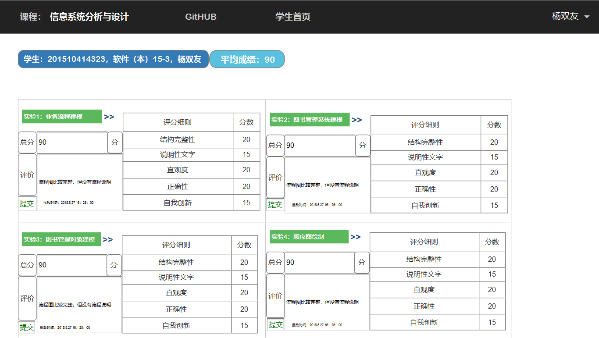

# “查看成绩”用例 [返回](./README.md)
## 1. 用例规约

|用例名称|查看成绩|
|-------|:-------------|
|功能|以表形式的显示出每个实验的成绩及详细分数|
|参与者|学生，老师|
|前置条件|学生，老师需要先登录|
|后置条件| |
|主流事件| |
|备注| |

## 2. 业务流程（顺序图） [源码](./sequence查看成绩.puml)
 

## 3. 界面设计
 

## 4. 参照表

- students
- grades
- tests

## 5. API接口设计

- 接口名称：getGrades
    
- 功能：
    返回学生的实验成绩。   
    
    学生登录，，老师登录可以看到实验详细评分，但是游客不能看到。
    
    该接口服务于：http://202.115.82.8:1521
    
- API请求地址： 
    http://202.115.82.8:1522/v1/api/getGrades

- 请求方式 ：
    GET  

- 请求参数说明:        
    无
    
- 返回实例：

        {
            "status": true,
            "info": null, 
            "total": 90,         
            "data": [
                {
                 "STUDENT_ID": "201510414323", 
                "RESULT": "90", 
                "MEMO":"流程图比较完整，但没有流程说明"
                "UPDATE_DATE": "2018.5.27 16：25：00"
                "PART":"结构完整性"
                "PART_GRADES":"20"}, 
                {
                ...其他实验
                }
            ] 
        }
  
- 返回参数说明：    
 
  |参数名称|说明|
  |:---------:|:--------------------------------------------------------|      
  |status|bool类型，true表示正确的返回，false表示有错误|
  |info|返回结果说明信息|
  |total|返回实验平均分|
  |data|所有实验的数组|
  |STUDENT_ID|学生学号|
  |RESULT|本实验成绩|
  |MEMO|老师评语|
  |UPDATE_DATE|批改时间|
  |PART|评分细则|
  |PART_GRADES|每个细则的分数|

