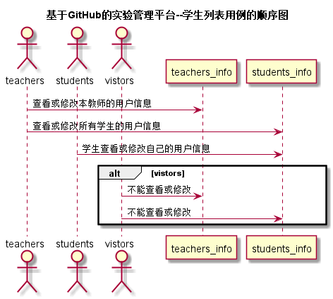
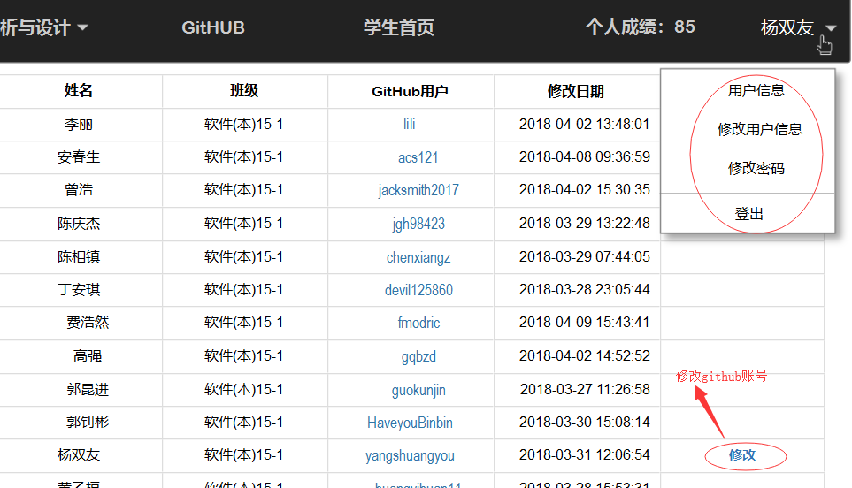
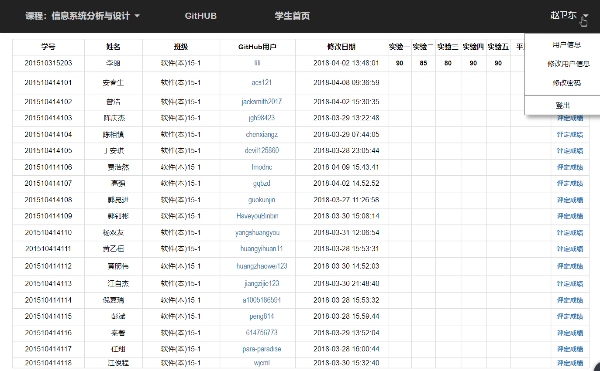

# “用户信息管理”用例 [返回](./README.md)
## 1. 用例规约

|用例名称|用户信息管理|
|-------|:-------------|
|功能|学生可对自己账号信息进行修改，老师即可修改自己的账号，也可增删改查学生的账号|
|参与者|老师，学生|
|前置条件|老师学生可以，游客不可以|
|后置条件| |
|主流事件| |
|备注| |

## 2. 业务流程（顺序图） [源码](./src/sequence评定成绩.puml)
 

## 3. 界面设计
### 3.1 学生信息管理界面设计
 

### 3.2 教师信息管理界面设计
 

## 4. 参照表

- students
- grades
- tests

## 5. API接口设计

- 接口名称：getUserInfo
    
- 功能：
    返回用户的信息。   
    
   只有老师登录可以修改自己的信息或者自己班上学生的信息，学生只能修改自己的信息，游客不能。
    
    该接口服务于：http://202.115.82.8:1521
    
- API请求地址： 
    http://202.115.82.8:1521/v1/api/getUserInfo

- 请求方式 ：
    GET  

- 请求参数说明:        
    无
    
- 返回实例：

        {
            "status": true,
            "info": null, 
            "total": 121,         
            "data": [
                {
                 "USER_ID": "9999", 
                "NAME": "测试人员", 
                "GITHUB_USERNAME":"yangshuangyou6"
                "UPDATE_DATE": "2018.5.27 16：25：00"
                "PASSWORD":"201510414323"
                "DISBALE":"否"}, 
                {
                ...其他用户
                }
            ] 
        }
  
- 返回参数说明：    
 
  |参数名称|说明|
  |:---------:|:--------------------------------------------------------|      
  |status|bool类型，true表示正确的返回，false表示有错误|
  |info|返回结果说明信息|
  |data|返回修改后用户信息|
  |USERS_ID|用户ID|
  |USERS_NAME|用户姓名|
  |GITHUB_NAME|Github用户名|
  |PASSWORD|用户密码|
  |DISBALE|是否禁用|
  