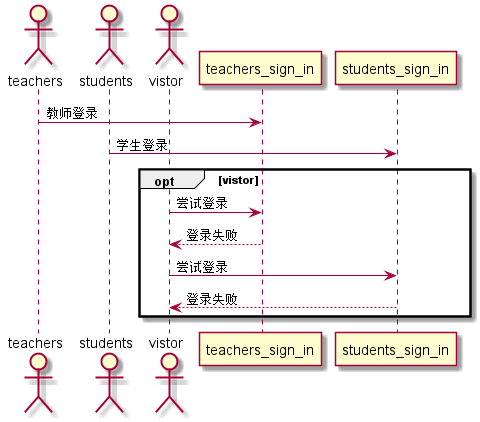
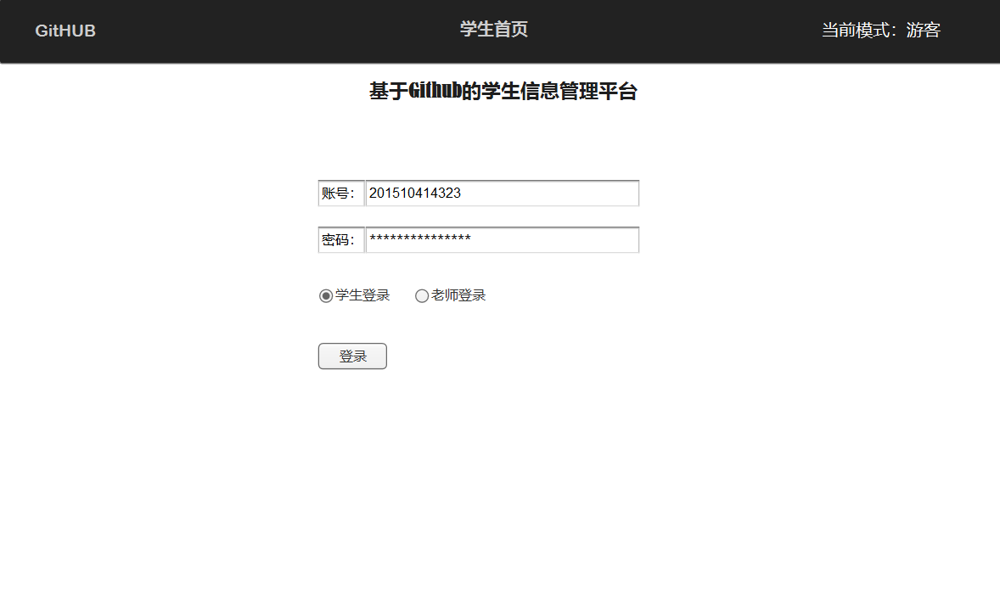

# “登录”用例 [返回](./README.md)
## 1. 用例规约

|用例名称|登录|
|-------|:-------------|
|功能|老师，学生选择登录|
|参与者|老师，学生|
|前置条件|学生，老师需可以登录，游客必须要有账号密码测能登录|
|后置条件||
|主流事件| |
|备注| |

## 2. 业务流程（顺序图） [源码](/sequence登录.puml)
 

## 3. 界面设计
 

## 4. 参照表

- students
- grades
- tests
- courses

## 6. API接口设计

- 接口名称：getSign
    
- 功能：
    返回一个false或者ture用于判断是否登录成功。   
    该接口服务于：http://202.115.82.8:1521
    
- API请求地址： 
    http://202.115.82.8:1521/v1/api/getSign

- 请求方式 ：
    GET  

- 请求参数说明:        
    无
    
- 返回实例：

        {
            "status": true,
            "info": null,          
            "data": [
                {"USER_ID": "201510414323", 
                "NAME": "杨双友", 
                "GITHUB_NAME": "yangshuangyou"
                "PASSWORD" :"201510414323"
                "DISBALE" :"否"
                }, 
            
            ] 
        }
  
- 返回参数说明：    
 
  |参数名称|说明|
  |:---------:|:--------------------------------------------------------|      
  |status|bool类型，true表示正确的返回，false表示有错误|
  |info|返回结果说明信息|
  |data|返回登陆信息|
  |USERS_ID|用户ID|
  |USERS_NAME|用户姓名|
  |GITHUB_NAME|Github用户名|
  |PASSWORD|用户密码|
  |DISBALE|是否禁用|
  
