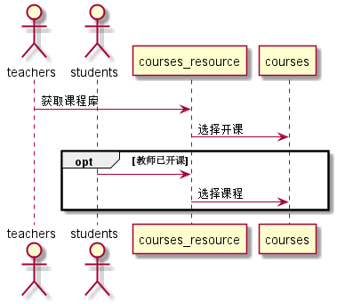
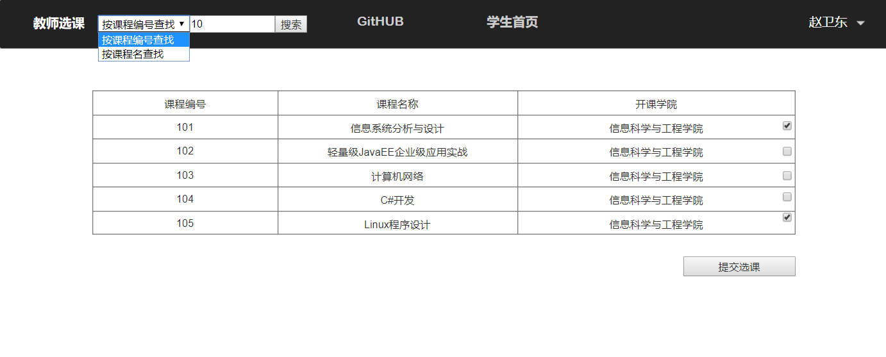
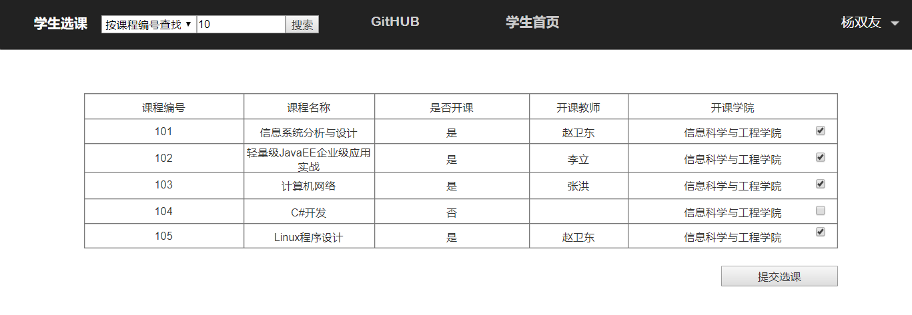

# “选课”用例 [返回](./README.md)
## 1. 用例规约

|用例名称|选课|
|-------|:-------------|
|功能|老师，学生选择本学期要上的课程|
|参与者|老师，学生|
|前置条件|学生，老师需要先登录，游客不能选课|
|后置条件|只有老师先选了这门课，学生才能选 |
|主流事件| |
|备注| |

## 2. 业务流程（顺序图） [源码](./sequence选课.puml)
 

## 3. 界面设计
 
 

## 4. 参照表

- students
- grades
- tests
- courses

## 6. API接口设计

- 接口名称：getCourses
    
- 功能：
    返回所有课程列表。   
    
    老师先选择课程进行开课，学生才能从老师选的课里面选课。
    
    该接口服务于：http://202.115.82.8:1521
    
- API请求地址： 
    http://202.115.82.8:1521/v1/api/getCourses

- 请求方式 ：
    GET  

- 请求参数说明:        
    无
    
- 返回实例：

        {
            "status": true,
            "info": null, 
            "total": 5,         
            "data": [
                {"COURSES_ID": "101", 
                "COURSES_NAME": "信息系统分析与设计", 
                "COURSES_TEACH": "赵卫东"
                "COURSES_COLL" :"信息科学与工程学院"
                }, 
                {
                ...其他课程
                }
            ] 
        }
  
- 返回参数说明：    
 
  |参数名称|说明|
  |:---------:|:--------------------------------------------------------|      
  |status|bool类型，true表示正确的返回，false表示有错误|
  |info|返回结果说明信息|
  |total|返回课程数|
  |data|所有课程的数组|
  |COURSES_ID|课程编号|
  |COURSES_NAME|课程名称|
  |COURSES_TEACH|开课教师|
  |COURSES_COLL|开课学院|
  
